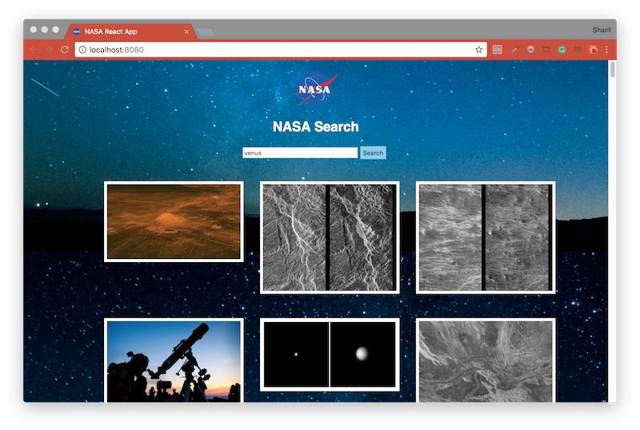

## [frontend-NASA-tech-test](https://jsainsburyplc.github.io/front-end-test/)
Develop a web application that integrates with the [NASA Image and Video Library](https://api.nasa.gov/api.html#MarsPhotos) API. It should allow users to search for assets and then select and view an asset.

<b>Heroku Link - https://nasa-image-search-frontend.herokuapp.com/</b>



#### Built with
* [npm](https://www.npmjs.com/) - Node Package Manager
* [React](https://www.npmjs.com/package/react) - An npm package to get you immediate access to React
* [React DOM](https://www.npmjs.com/package/react-dom) - This package serves as the entry point of the DOM-related rendering paths
* [React Router Dom](https://www.npmjs.com/package/react-router-dom) - DOM bindings for React Router
* [Prop Types](https://www.npmjs.com/package/prop-types) - Runtime type checking for React props and similar objects
* [Enzyme](https://www.npmjs.com/package/react-test-renderer) - JavaScript Testing utilities for React
* [Webpack](https://www.npmjs.com/package/webpack-dev-server) - Updates the browser on changes
* [Babel](https://babeljs.io/) - Convert JSX syntax and strip out type annotations
* [axios](https://github.com/axios/axios) - Promise based HTTP client for the browser and node.js

#### Installation
To run this project you will need to download it onto your local machine and install all dependencies.
Navigate inside the folder and install all dependencies by entering the following command on your terminal window:
```
npm install
```
Finally to run the server enter the following command in your terminal window:
```
npm start
```
This will run the server, open [http://localhost:8080](http://localhost:8080) to view it in the browser. If you make any changes and save the changes process will automatically refresh and you will be able to see the results in the browser.

If you want to end the process hold `control` and press `c` in mac, if you are not using mac hold `ctrl` and press `c`.

#### Wireframes
The following wireframes show a high-level representation of the content and user flow - we encourage you to go above and beyond what is presented, demonstrating your UX/UI as well as coding skills:


#### API
The images API contains 4 endpoints GET https://images-api.nasa.gov

| Endpoint                | Description                                  |
|-------------------------|----------------------------------------------|
| GET /search?q={q}	      | Performing a search                          | 
| GET /asset/{nasa_id}	  | Retrieving a media asset’s manifest          | 
| GET /metadata/{nasa_id}	| Retrieving a media asset’s metadata location |
| GET /captions/{nasa_id}	| Retrieving a video asset’s captions location |

#### Reference / documentation
- https://images.nasa.gov/docs/images.nasa.gov_api_docs.pdf (PDF docs)
- https://api.nasa.gov/api.html#Images
- https://images.nasa.gov (website)

This project was bootstrapped with [MCRcodes/react-bootstrap](https://github.com/MCRcodes/react-bootstrap).
